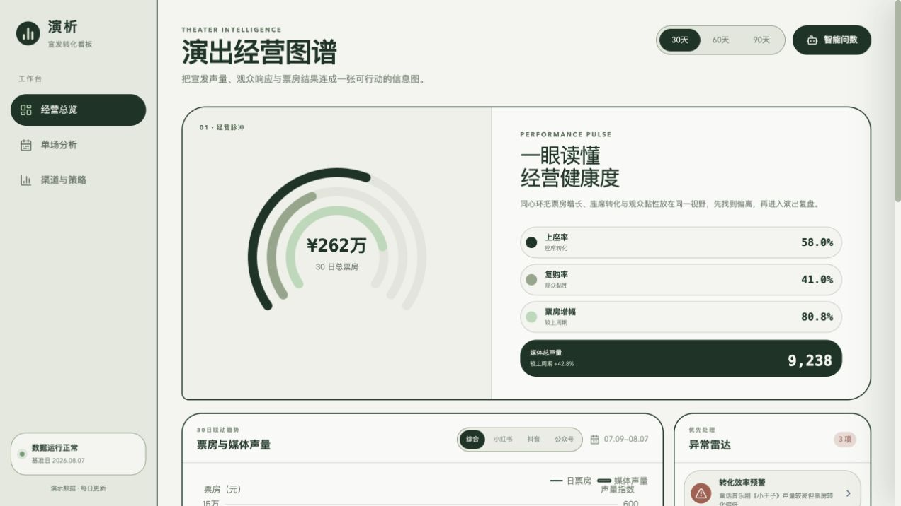

# 演析 · 剧院经营数据看板

面向剧院宣发运营与管理人员的经营分析看板，将票房、售票目标、宣传节奏、会员增长和渠道效果集中在同一套分析流程中，帮助运营人员快速发现异常并进入单场演出复盘。



## 核心功能

- 经营总览：总票房、售票完成率、上座率及宣传量趋势。
- 经营总表：按日、周、月查看售票数/金额、宣传量、会员增长和新媒体粉丝增长。
- 单场分析：预计售票目标、完成进度、票房曲线、渠道贡献、销售时段和策略 ROI。
- 跨项目复盘：比较渠道效率、策略效果及最佳实践。
- 智能问数：通过受控查询模板回答票房排名、渠道贡献、完成率和经营汇总问题。

## 技术栈

- 前端：React、TypeScript、Vite、TanStack Query、ECharts、Framer Motion
- 后端：Node.js、Express、SQLite、better-sqlite3
- 测试：Node.js Test Runner、TypeScript 类型检查、Vite 生产构建

## 本地运行

项目需要 Node.js 18 或更高版本，并分别启动后端和前端。

```bash
# 终端 1：启动后端
cd theater-dashboard/server
npm install
npm run seed
npm run dev
```

```bash
# 终端 2：启动前端
cd theater-dashboard/client
npm install
npm run dev
```

访问 [http://localhost:5173](http://localhost:5173)，后端默认运行在 `http://localhost:3001`。

## 校验

```bash
cd theater-dashboard/server
npm test

cd ../client
npm run typecheck
npm run build
```

## 项目结构

```text
.
├── PRD.md                         # 产品需求文档
└── theater-dashboard
    ├── client                     # React 前端
    ├── server                     # Express API 与测试
    ├── data/theater.db            # SQLite 演示数据库
    ├── PRODUCT.md                 # 产品闭环说明
    └── DESIGN.md                  # 视觉与组件规范
```

> 当前仓库使用可复现的演示数据，不包含真实用户或交易信息。

更多说明见 [项目文档](./theater-dashboard/README.md) 和 [后端 API 文档](./theater-dashboard/server/README.md)。
