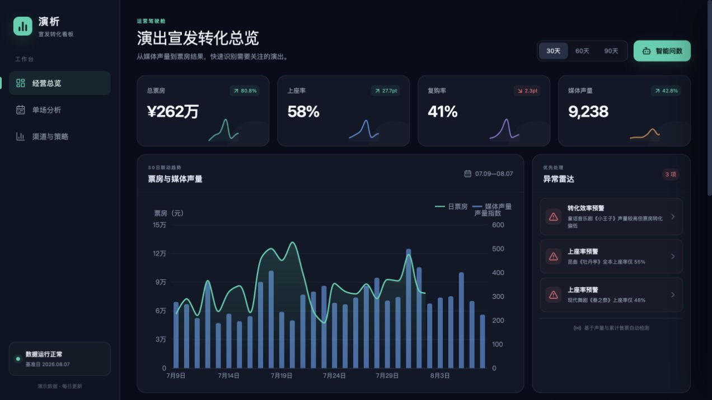
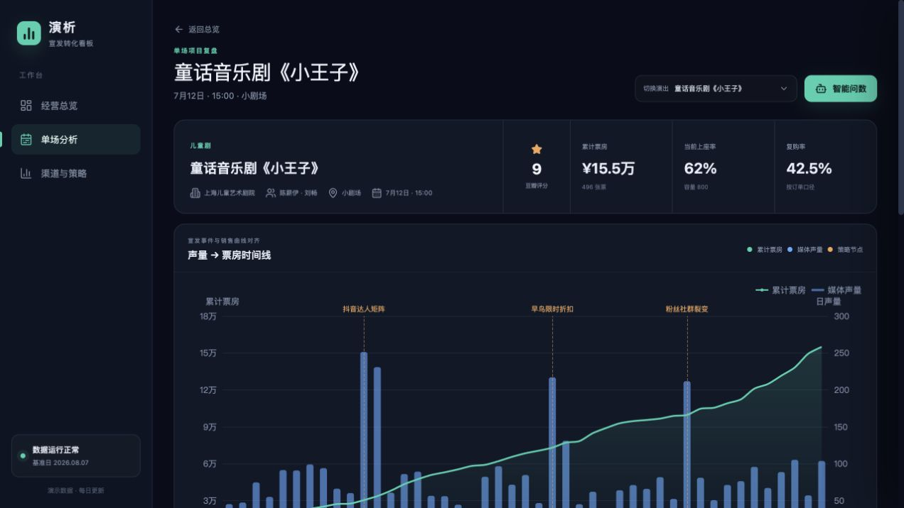
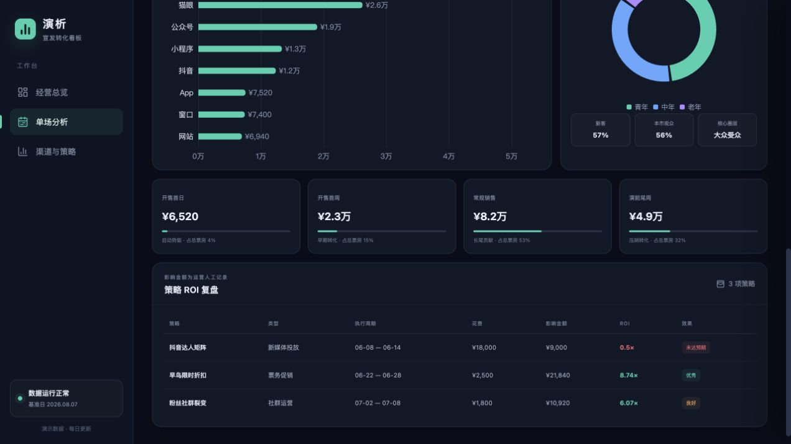
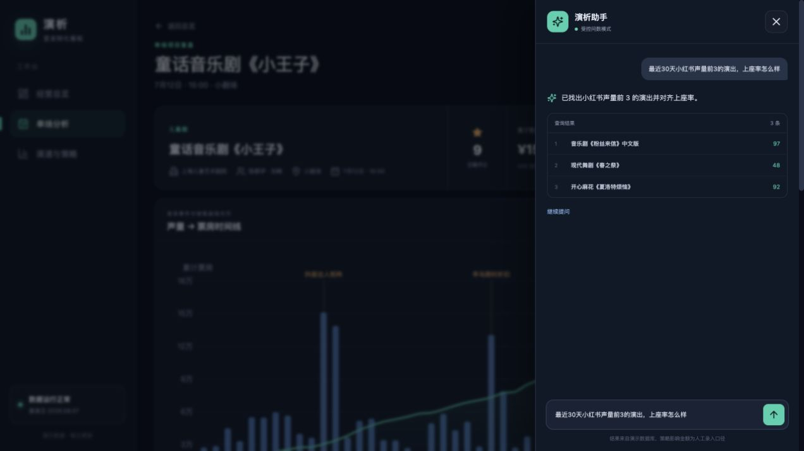

# 演析核心交互审计

## 范围

- 用户：剧院宣发运营
- 核心任务：从总览发现异常，进入单场寻找原因，检查策略 ROI，并用智能问数补充证据
- 模式：UX + 可访问性风险审计

## Step 1 · 总览发现异常（健康：良好）

优点：四项指标、趋势与异常雷达形成了清楚的阅读顺序；异常位于首屏且可以直接下钻。

问题：页面更像“读数据”，还不像“处理问题”。时间筛选切换缺少明确反馈；指标卡无法下钻；双轴趋势没有平台切换；异常卡只说发生了什么，没有展示证据、建议动作、负责人或处理状态。

建议：点击异常后先打开上下文面板，展示触发规则、关键证据、推荐动作和“进入单场分析”；给指标卡与图例增加筛选和联动反馈。

## Step 2 · 异常下钻到单场（健康：中等）

优点：项目身份、票房、上座率、复购率和时间线集中在首屏，策略节点与销售曲线视觉关系清楚。

问题：用户从“高声量低转化”进入后，异常原因没有被带到单场页；三个策略节点不可点击，无法检查当天数据；时间线缺少媒体平台切换、缩放区间和声量到订单的滞后对齐；继续向下滚动后项目上下文消失。

建议：在项目头部增加“本次关注原因”；策略节点可选中并弹出事件详情；增加平台开关、区间刷选和 3–5 天滞后视图；使用粘性项目栏或页内锚点。

## Step 3 · 检查策略 ROI（健康：中等）

优点：低 ROI 使用红色突出，投入、影响金额和效果标签容易比较。

问题：策略表位于长页面底部，与时间线节点没有联动；无法排序、展开策略依据、记录结论或标记下一步动作。当前状态适合汇报，不适合运营复盘协作。

建议：点击时间线策略节点后定位并高亮表格行；支持按 ROI/花费排序、展开“影响金额依据”，并增加简短的复盘结论与负责人状态。

## Step 4 · 智能问数补充证据（健康：需优化）

优点：建议问题降低输入门槛，抽屉不会打断当前页面上下文。

问题：用户问“小红书声量前 3 及上座率”，结果只显示无单位的 `97 / 48 / 92`，没有同时展示小红书笔记数和 `%`，证据不完整；结果无法点击进入演出；助手也没有利用当前正在查看的《小王子》作为上下文。

建议：结果使用带字段名和单位的双指标卡；每行可跳转单场；在单场页默认提供“分析当前演出为何转化偏低”等上下文问题；为加载和结果更新增加 `aria-live`。

## 可访问性风险

- 大量辅助文字为 8–10px，低对比灰色在深色背景上可能难以阅读。
- 部分控件高度为 30–38px，触控目标偏小。
- ECharts 画布只有整体文本标签，没有可供屏幕阅读器读取的等价数据表。
- 智能问数抽屉关闭时仍存在于 DOM；仅使用 `aria-hidden` 可能无法阻止键盘焦点进入隐藏控件。
- 筛选、加载和 AI 返回结果没有明确的实时区域提示。

截图无法证明完整 WCAG 合规；仍需键盘顺序、焦点陷阱、对比度和屏幕阅读器专项测试。

## 推荐制作的三张原型状态

1. **异常处理面板**：总览点击预警后，右侧展示触发规则、证据、建议动作和下钻入口。
2. **单场分析工作台**：粘性项目栏、媒体平台开关、可选策略节点、区间缩放和滞后对齐。
3. **AI 证据答案**：双指标结果、字段单位、项目跳转和当前演出上下文建议。

这三张状态图比重新生成整套页面更有价值，因为它们直接验证交互结构，不会破坏现有视觉系统。
